# StudentAssistant


StudentAssistant is a full-stack, role-based academic productivity platform for university students and administrators. It combines course resource management, routine planning, task tracking, AI-powered study tools, communication, notifications, analytics, moderation, and system administration in one web application.

The project uses a Django REST backend and a React + Vite frontend. Normal users get a student workspace, while staff/superusers get a dedicated administration workspace with separate routing, sidebar sections, API controls, audit history, and moderation tools.

## Table Of Contents

- [Screenshots](#screenshots)
- [Core Features](#core-features)
- [Role-Based Access](#role-based-access)
- [Tech Stack](#tech-stack)
- [Project Structure](#project-structure)
- [Backend Apps](#backend-apps)
- [Frontend Architecture](#frontend-architecture)
- [API Overview](#api-overview)
- [Environment Variables](#environment-variables)
- [Installation And Setup](#installation-and-setup)
- [Testing And Verification](#testing-and-verification)
- [Development Notes](#development-notes)

## Screenshots

All screenshots are stored in `Documentations/SystemImages`.

### Authentication

<div>
  <a href="Documentations/SystemImages/Login.png" target="_blank">
    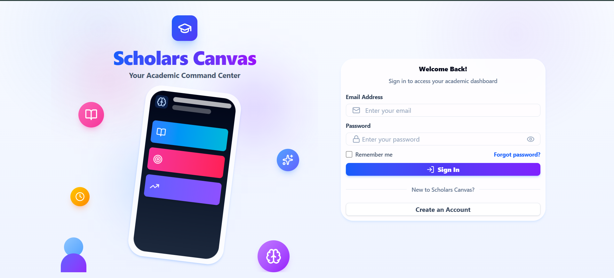
  </a>
  <a href="Documentations/SystemImages/Registration.png" target="_blank">
    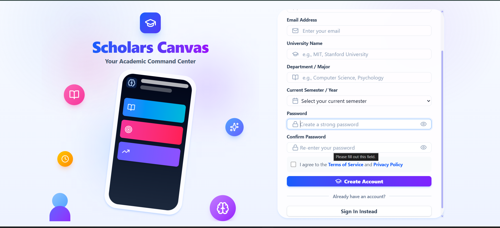
  </a>
</div>

### Normal User Workspace

<div>
  <a href="Documentations/SystemImages/UserDashboard.png" target="_blank">
    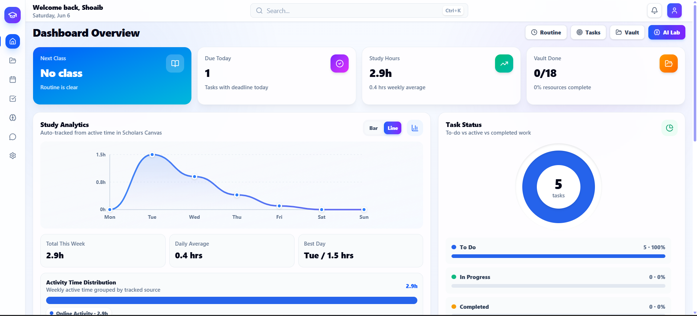
  </a>
  <a href="Documentations/SystemImages/UserRoutine.png" target="_blank">
    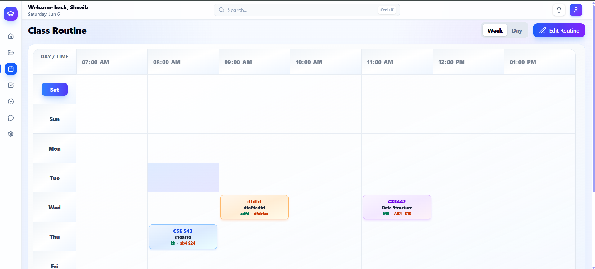
  </a>
  <a href="Documentations/SystemImages/UserTodoList.png" target="_blank">
    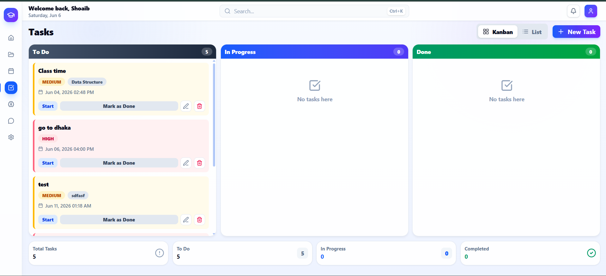
  </a>
</div>

<div>
  <a href="Documentations/SystemImages/UserResourceVault.png" target="_blank">
    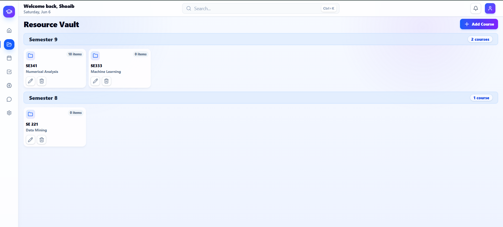
  </a>
  <a href="Documentations/SystemImages/UserResourceWorkspace.png" target="_blank">
    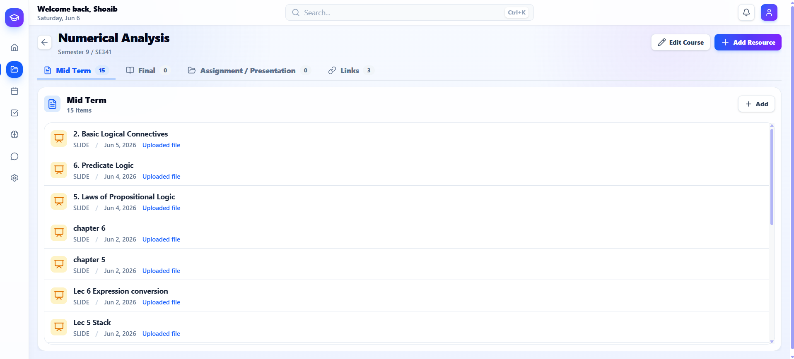
  </a>
  <a href="Documentations/SystemImages/UserAILab.png" target="_blank">
    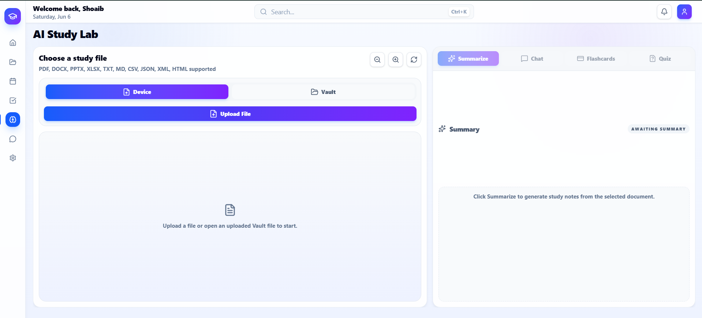
  </a>
</div>

<div>
  <a href="Documentations/SystemImages/UserCommunication.png" target="_blank">
    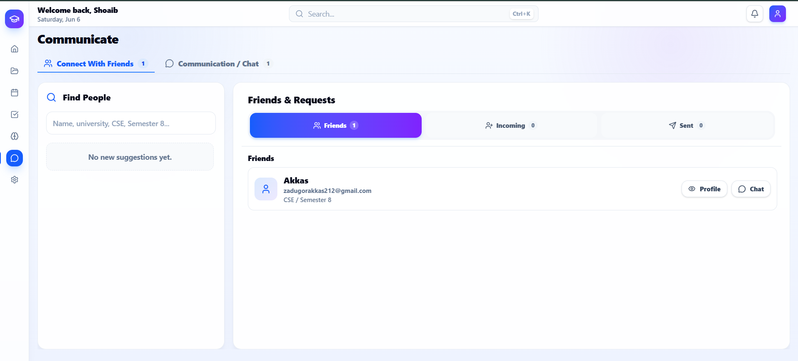
  </a>
  <a href="Documentations/SystemImages/SettingsOptions.png" target="_blank">
    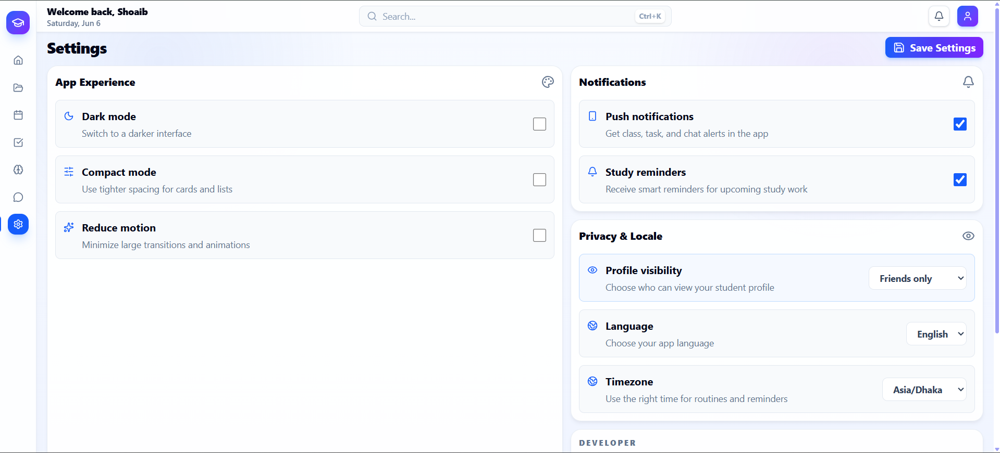
  </a>
</div>

### Administration Workspace

<div>
  <a href="Documentations/SystemImages/AdminDashboard.png" target="_blank">
    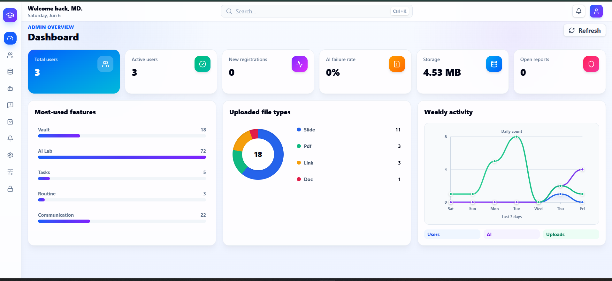
  </a>
  <a href="Documentations/SystemImages/AdminUserManagement.png" target="_blank">
    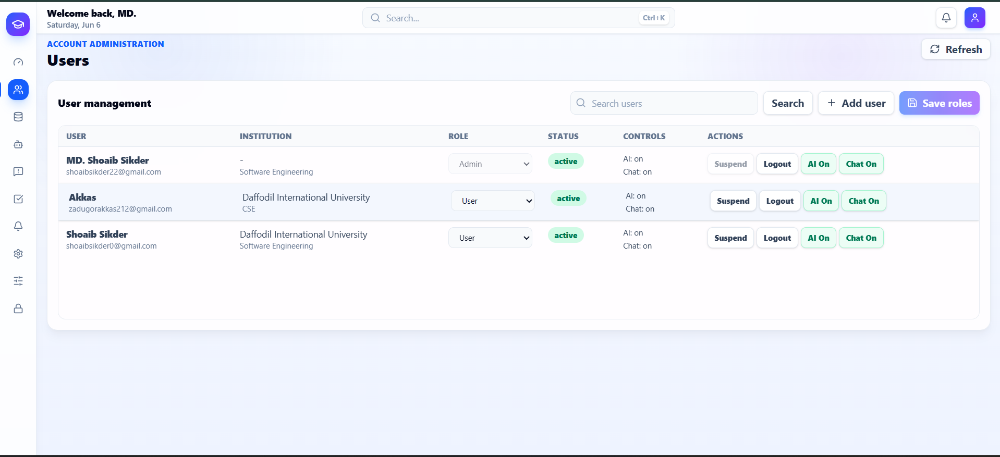
  </a>
  <a href="Documentations/SystemImages/AdminCourseResourceManagement.png" target="_blank">
    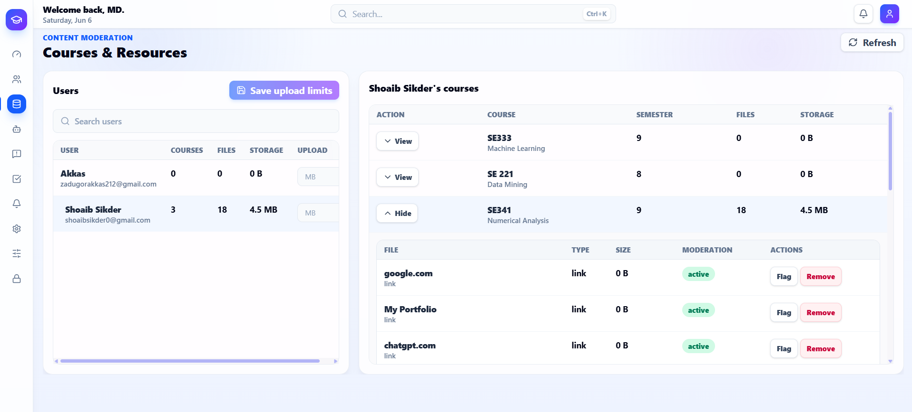
  </a>
</div>

<div>
  <a href="Documentations/SystemImages/AdminAIUsageManagement.png" target="_blank">
    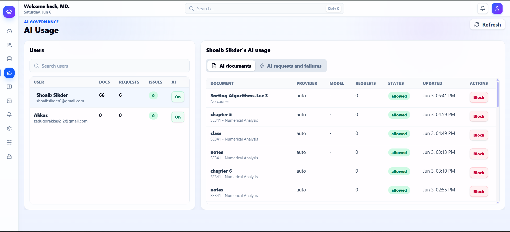
  </a>
  <a href="Documentations/SystemImages/AdminCommunicationReport.png" target="_blank">
    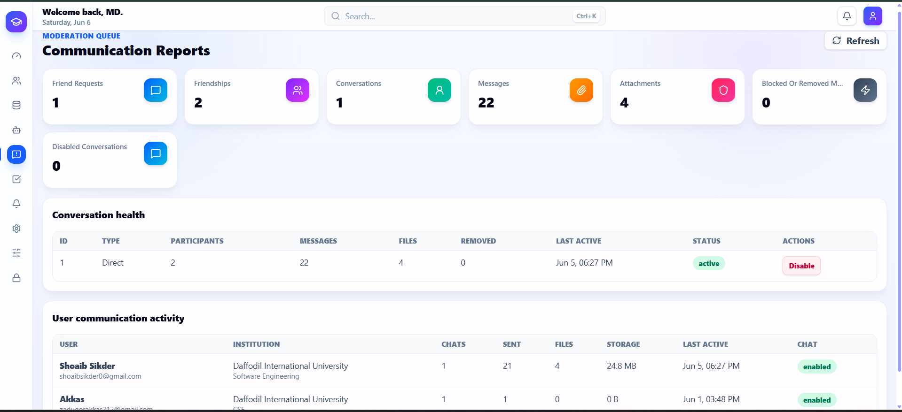
  </a>
  <a href="Documentations/SystemImages/AdminTaskRoutineReport.png" target="_blank">
    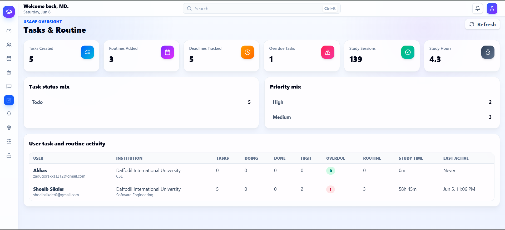
  </a>
</div>

<div>
  <a href="Documentations/SystemImages/AdminNotification.png" target="_blank">
    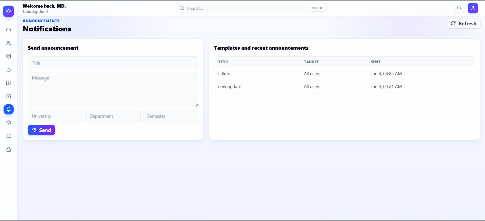
  </a>
  <a href="Documentations/SystemImages/AdminSystemControl.png" target="_blank">
    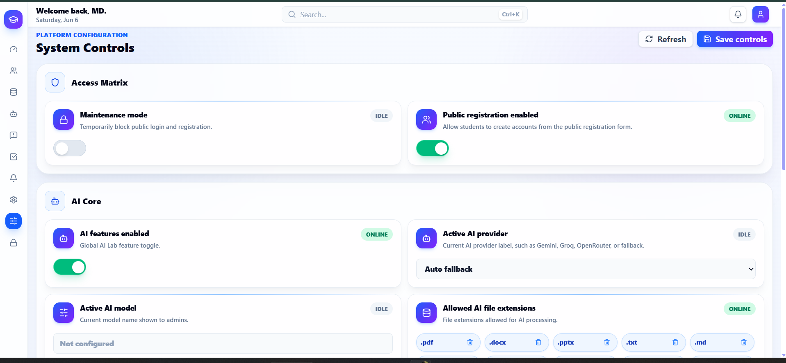
  </a>
  <a href="Documentations/SystemImages/AdminAuditLog.png" target="_blank">
    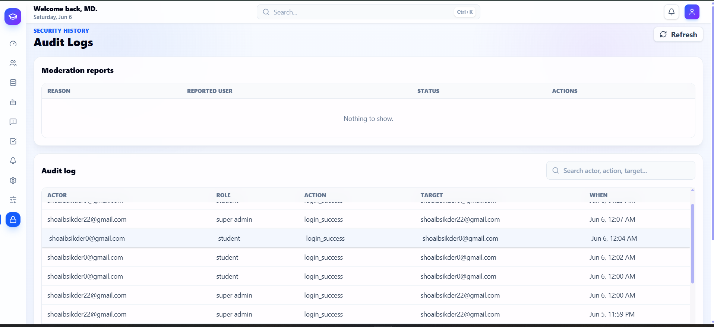
  </a>
</div>

## Core Features

### Authentication And Account Management

- Register with university profile information.
- Login with token-based authentication.
- Password reset request and confirmation flow.
- Persistent authentication using stored token.
- User profile loading from the backend.
- Dark mode, compact mode, reduced motion, and preference persistence.
- Public profile lookup for communication and user context.
- Role-aware login redirect:
  - Normal users go to the student workspace.
  - Staff/superusers/admin roles go to the admin workspace.

### Normal User Dashboard

- Academic overview with dashboard statistics.
- Recent resources and course activity.
- Task status summary.
- Deadline timeline.
- Study analytics and session tracking.
- Quick navigation into Vault, Tasks, Routine, AI Lab, Communication, Profile, and Settings.

### Routine Planner

- Weekly routine management.
- Add, update, and remove routine slots.
- Current class banner.
- Routine grid and list views.
- Time/day-aware class organization.
- Status messaging and validation feedback.

### Tasks And Study Tracking

- Create assignments, reminders, and study tasks.
- Update task details and status.
- Kanban board style task workflow.
- Task table/list view.
- Task statistics.
- Study session tracking.
- Deadline and priority handling.
- Per-task study progress support.

### Course And Resource Vault

- Create and manage courses.
- Upload course resources.
- Supported resource types include PDFs, documents, presentations, links, and other allowed file types configured by admin settings.
- Course workspace for selected course resources.
- Resource preview/open flows.
- Resource metadata such as type, size, course, and owner.
- Delete/update resources.
- Open selected resources from search or dashboard.
- Send Vault resources into AI Lab for processing.

### AI Lab

- Upload AI study documents.
- Create AI documents from Vault resources.
- Generate summaries.
- Generate quizzes.
- Generate MCQ quizzes.
- Chat with AI over selected study material.
- AI provider/model support through backend settings.
- AI document processing status and error handling.
- Admin-controlled AI availability and file processing policy.

### Communication

- Search normal student users.
- Suggested friends based on profile similarity and mutual connections.
- Send, accept, reject, and cancel friend requests.
- Friend list management.
- One-to-one conversations with friends.
- Group conversation creation with friend-only restriction.
- Send text messages.
- Send file attachments, subject to upload limits and allowed file settings.
- Edit and unsend own messages.
- Message notifications.
- Backend protections prevent admin accounts from appearing as suggested friends or being added to chats.

### Notifications

- Notification panel in the app shell.
- Unread count.
- Load more notifications.
- Mark notifications as read.
- System announcements from admin.
- Targeted announcements by university, department, or semester.
- Notification source tracking.

### Search And Command Bar

- Global command/search input.
- Keyboard shortcut support with `Ctrl+K`.
- Page search.
- Resource search.
- Mode-aware routing:
  - Normal users only see normal-user pages and resources.
  - Admin users only see admin sections.
- Search result selection opens the correct route or resource.

### Settings And Preferences

- Profile and account preference controls.
- Dark mode.
- Compact mode.
- Reduced motion.
- Email and push notification preferences.
- Study reminder preferences.
- Profile visibility, language, and timezone preferences.

## Administration Features

The admin workspace uses the same application shell as the normal user workspace, but the sidebar switches to admin-only sections.

### Admin Dashboard

- Total users.
- Active users.
- New registrations.
- AI failure rate.
- Storage usage.
- Open reports.
- Most-used features.
- Uploaded file type analytics.
- Weekly activity charts.

### User Management

- View users.
- Search users.
- Create users.
- Change user role between normal user and admin access.
- Suspend and unsuspend users.
- Force logout.
- Toggle AI access per user.
- Toggle messaging access per user.
- View university, department, semester, status, AI, and chat controls.
- Fixed-height user table with internal scrolling.

### Courses And Resources

- View all user-created courses.
- View uploaded resources.
- Track resource owner, course, type, size, and moderation status.
- Flag resources.
- Remove resources.
- Restore resources.
- Revoke public/shared access.
- Track course storage usage and resource counts.

### AI Usage Control

- Monitor AI documents.
- Monitor AI request logs.
- View provider/model, request count, status, and errors.
- Block or allow AI processing for documents.
- Track failed AI jobs.

### Communication Reports

- View friendship, friend request, conversation, message, attachment, report, and blocked/messaging-disabled statistics.
- View conversations.
- Disable or enable conversations.
- Audit chat files and messages.
- Remove or restore inappropriate messages.

### Tasks And Routine Oversight

- Aggregate task and routine statistics.
- Usage counts without exposing personal task content.
- Privacy-preserving admin view for support and moderation.

### Admin Notifications

- Send system-wide announcements.
- Send targeted announcements by university, department, or semester.
- View recent announcements.
- Fixed-height notification cards with internal scrolling.

### Analytics

- Feature usage analytics.
- Uploaded file type distribution.
- Weekly users, AI usage, and upload trends.
- Dashboard-level platform health metrics.

### System Settings

- Manage system settings stored in the backend.
- Configure registration availability.
- Configure maintenance mode.
- Configure upload limits.
- Configure allowed file extensions.
- Configure AI provider/model behavior.
- Configure rate limits and group chat limits.
- Settings are saved through admin-only API endpoints.

### Audit Logs And Moderation

- View moderation reports.
- Review, resolve, or dismiss reports.
- View audit logs for security and admin actions.
- Track actor, role, action, target, and timestamp.
- Login success and admin actions appear in the audit history.

## Role-Based Access

StudentAssistant has separate normal-user and admin workspaces.

### Normal User Access

Normal users can access:

- `/`
- `/routine`
- `/tasks`
- `/vault`
- `/ai-lab`
- `/communication`
- `/profile`
- `/settings`

Normal users cannot access:

- `/admin`
- `/admin/users`
- `/admin/resources`
- `/admin/ai`
- `/admin/communication`
- `/admin/tasks`
- `/admin/notifications`
- `/admin/analytics`
- `/admin/settings`
- `/admin/audit`

### Admin Access

Admin users include:

- Django `is_staff`
- Django `is_superuser`
- `support_admin`
- `moderator`
- `super_admin`

Admin users can access admin routes and are redirected away from normal-user pages. Admin search is also limited to admin sections, preventing accidental navigation into normal-user features.

### Communication Safety

- Admin accounts do not appear in friend suggestions.
- Admin accounts do not appear in user search for communication.
- Normal users cannot send friend requests to admin accounts through the API.
- Admin accounts cannot use normal communication APIs.

## Tech Stack

### Frontend

- React 19
- Vite 7
- React Router 7
- Tailwind CSS 4
- Framer Motion
- Lucide React icons

### Backend

- Django 6
- Django REST Framework
- DRF token authentication
- Django Channels
- Daphne
- PostgreSQL
- Supabase storage integration
- Resend email integration
- pypdf, pdfplumber, PyMuPDF
- python-docx
- python-pptx
- openpyxl
- pytesseract
- BeautifulSoup

## Project Structure

```text
StudentAssistant/
  Documentations/
    SystemImages/

  backend/
    apps/
      accounts/
      administration/
      ai_lab/
      communication/
      courses/
      notification/
      resources/
      search/
      tasks/
    core/
      settings.py
      urls.py
      asgi.py
      wsgi.py
    manage.py
    requirements.txt
    .env.example

  frontend/
    public/
    src/
      api/
        adminApi.js
        aiLabApi.js
        authApi.js
        client.js
        communicationApi.js
        dashboardApi.js
        endpoints.js
        notificationApi.js
        resourceApi.js
        routineApi.js
        taskApi.js
      components/
        common/
        layout/
      context/
        AuthContext.jsx
        NotificationsContext.jsx
      features/
        auth/
        normal-user/
          ai-tools/
          communication/
          dashboard/
          profile/
          resources/
          routine/
          settings/
          tasks/
        administration/
          admin-panel/
          ai-usage/
          analytics/
          audit-logs/
          communication-reports/
          dashboard/
          notifications/
          resources/
          system-settings/
          tasks-routine/
          users/
      hooks/
      layouts/
      routes/
      styles/
      App.jsx
      main.jsx
    package.json

  README.md
```

## Backend Apps

### `accounts`

Handles custom user model, roles, authentication, registration, password reset, profile, preferences, account status, admin role metadata, and profile APIs.

### `courses`

Provides student dashboard and course-level app endpoints.

### `tasks`

Handles tasks, study sessions, routine-related productivity data, and task analytics.

### `resources`

Handles Vault courses, uploaded resources, resource metadata, moderation status, sharing controls, and storage tracking.

### `ai_lab`

Handles AI study documents, parsing, summaries, quizzes, MCQs, document chat, provider fallback logic, and AI logs.

### `communication`

Handles friends, friend requests, conversations, group chats, messages, attachments, and communication restrictions.

### `notification`

Handles user notifications, system announcements, unread state, and read tracking.

### `search`

Provides app-wide search for normal-user content.

### `administration`

Provides admin-only dashboard, user management, resource control, AI control, communication moderation, notification management, settings, moderation reports, and audit logs.

## Frontend Architecture

### `App.jsx`

The app entry route map. It wires auth routes, normal-user protected routes, admin protected routes, and fallback redirects.

### `routes/ProtectedRoute.jsx`

Protects routes by role:

- `userOnly`
- `adminOnly`
- authentication required
- profile-loading guard

### `layouts/AppLayout.jsx`

Shared app shell used by both normal users and admins. It controls:

- active page from URL
- sidebar mode
- search mode
- notifications
- keyboard shortcut handling
- study time tracking
- outlet context for page routes

### `components/layout`

Contains the shared sidebar, command bar, notification panel, and main layout.

### `features/normal-user`

Contains student-facing feature modules.

### `features/administration`

Contains admin-facing feature modules, split by admin section.

### `api`

The frontend API layer is split by domain:

- `authApi.js`
- `dashboardApi.js`
- `notificationApi.js`
- `routineApi.js`
- `taskApi.js`
- `resourceApi.js`
- `aiLabApi.js`
- `communicationApi.js`
- `adminApi.js`
- `client.js`
- `endpoints.js`

## API Overview

Base API URL:

```text
http://localhost:8000/api
```

Frontend environment variable:

```env
VITE_API_BASE_URL=http://localhost:8000/api
```

### Auth API

| Method | Endpoint | Purpose |
| --- | --- | --- |
| POST | `/api/auth/register/` | Register a normal user |
| POST | `/api/auth/login/` | Login and receive token |
| POST | `/api/auth/password-reset/request/` | Request password reset |
| POST | `/api/auth/password-reset/confirm/` | Confirm password reset |
| GET/PATCH | `/api/auth/me/` | Get or update current user |
| GET | `/api/auth/users/<id>/profile/` | Public profile |

### Normal User API Groups

| Group | Base Endpoint | Purpose |
| --- | --- | --- |
| Dashboard | `/api/app/dashboard/` | User dashboard data |
| Search | `/api/app/search/` | App-wide normal-user search |
| Routine | `/api/app/routine/` | Routine slots |
| Tasks | `/api/app/tasks/` | Tasks and study sessions |
| Resources | `/api/app/resources/` | Vault courses and resources |
| AI Lab | `/api/app/ai-lab/` | AI documents, summary, quiz, chat |
| Communication | `/api/app/communication/` | Friends, requests, conversations, messages |
| Notifications | `/api/app/notification/` | Notifications and read state |

### Admin API Groups

| Endpoint | Purpose |
| --- | --- |
| `/api/admin-panel/overview/` | Admin dashboard metrics |
| `/api/admin-panel/users/` | User management |
| `/api/admin-panel/users/<id>/` | User updates and admin actions |
| `/api/admin-panel/resources/` | Course/resource monitoring |
| `/api/admin-panel/resources/<id>/` | Resource moderation actions |
| `/api/admin-panel/ai/` | AI usage and logs |
| `/api/admin-panel/ai/documents/<id>/` | AI document controls |
| `/api/admin-panel/communication/` | Communication reports |
| `/api/admin-panel/communication/conversations/<id>/` | Conversation moderation |
| `/api/admin-panel/communication/messages/<id>/` | Message moderation |
| `/api/admin-panel/moderation/` | Report queue |
| `/api/admin-panel/moderation/reports/<id>/` | Report review actions |
| `/api/admin-panel/tasks-routine/` | Aggregate tasks/routine oversight |
| `/api/admin-panel/notifications/` | Announcements and templates |
| `/api/admin-panel/settings/` | System settings |
| `/api/admin-panel/audit-logs/` | Audit logs |

## Environment Variables

Backend `.env` example:

```env
SECRET_KEY=change-me
DEBUG=True
ALLOWED_HOSTS=localhost,127.0.0.1

GROQ_API_KEY=your-groq-api-key
OPENROUTER_API_KEY=your-openrouter-api-key
GROQ_MODEL=llama-3.3-70b-versatile
OPENROUTER_MODELS=nvidia/nemotron-3-nano-30b-a3b:free,google/gemma-4-31b-it:free,openrouter/free
OPENROUTER_SITE_URL=http://localhost:5173
OPENROUTER_APP_NAME=Scholars Canvas

FRONTEND_URL=http://localhost:5173
RESEND_API_KEY=your-resend-api-key
RESEND_FROM_EMAIL=onboarding@resend.dev

SUPABASE_URL=https://your-project-id.supabase.co
SUPABASE_KEY=your-anon-or-service-role-key
SUPABASE_MEDIA_BUCKET=StudyMaterials
```

Frontend `.env` example:

```env
VITE_API_BASE_URL=http://localhost:8000/api
```

## Installation And Setup

### Prerequisites

- Python 3.11+
- Node.js 20+
- PostgreSQL
- Tesseract OCR installed locally if OCR features are needed
- Supabase project/bucket if using Supabase media storage
- AI provider keys for AI Lab features

### Backend Setup

```bash
cd backend
python -m venv venv
venv\Scripts\activate
pip install -r requirements.txt
copy .env.example .env
python manage.py migrate
python manage.py createsuperuser
python manage.py runserver
```

Backend default URL:

```text
http://localhost:8000
```

Django admin:

```text
http://localhost:8000/admin/
```

### Frontend Setup

```bash
cd frontend
npm install
npm run dev
```

Frontend default URL:

```text
http://localhost:5173
```

### Production Build

```bash
cd frontend
npm run build
```

### Optional ASGI/Daphne Run

```bash
cd backend
python -m daphne core.asgi:application
```

## Testing And Verification

Backend system check:

```bash
cd backend
python manage.py check
```

Frontend build check:

```bash
cd frontend
npm run build
```

Common route smoke checks:

```text
/
/tasks
/admin
/admin/users
/admin/settings
```

## Development Notes

- The frontend uses React Router routes instead of manually switching pages in `App.jsx`.
- Normal-user and admin feature folders are separated.
- Admin sections use dedicated folders for each admin capability.
- The top command/search bar is role-aware.
- The sidebar switches mode based on whether the current route is normal user or admin.
- Admin accounts are intentionally blocked from normal communication/friend features.
- Normal users are intentionally blocked from admin features in frontend guards and backend APIs.
- Some admin tables and panels use fixed-height internal scrolling to avoid stretching the whole page.
- `Moderation reports` will remain empty until users report content or accounts.
- `Audit logs` can contain login, security, and admin action history even when moderation reports are empty.

## License

This project is currently provided for academic/project use. Add a license file if you plan to publish or distribute it publicly.

